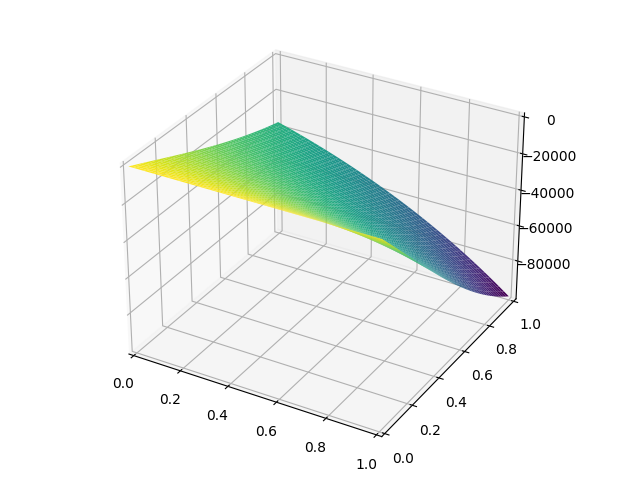

# Proyecto de Curso

**En este repositorio se presentan expresiones demasiado extensas como para mostrarlas en el documento oficial.**

Iteración 20 para v_20 y w_20 en los ficheros i_20_v e i_20_w respectivamente.

 

  

    
  

  

    

 

 

